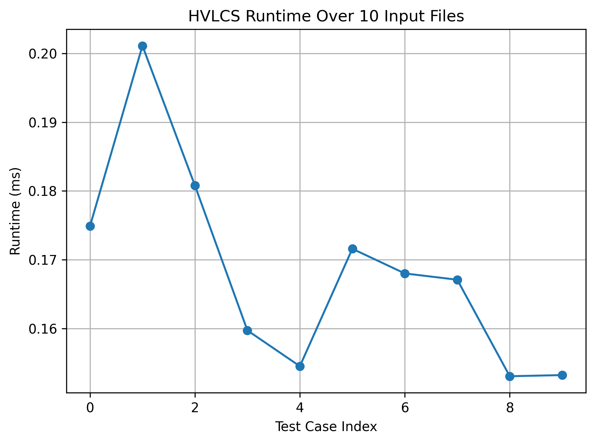

# COP4533-Programming_Assignment_3
Braden Azis

## How to Run

Firstly activate environment:
``` source .venv/bin/activate ```

If you're just wanting to pass in a specific input file, pipe it in.

Example:
    ``` ./hvlcs < inputs/test.txt ```

If you're wanting to rerun the empirical runtime script, first UNCOMMENT the last line in ```HVLCS.cpp``` which outputs the runtime to stderr. 
Once doing so, can run the shell script to export the runtimes of each input into the ```runtimes.txt``` file:

``` ./run_tests.sh ```

Once runtimes.txt is generated, simply run the ```graph.py``` and the runtime plot will be visible.

## Question 1




## Question 2


This reccurence is correct because each common subsequence either uses the pair of matching chars A[i] = B[j] or skips one char from one of the strings.

If the characters match, including them is always at least as good as skipping them because they add a positve value and skipping will always be handled by the mismatch case.

If the characters do not match, then the optimal subsequence must begin by skipping one char and the DP then considers both choices optimally. 


## Question 3

```
HVLCS-VALUE(A, B, value):
    n = length(A)
    m = length(B)

    create DP table of size (n+1) × (m+1)
    
    for i from 0 to n:
        DP[i][m] = 0
    for j from 0 to m:
        DP[n][j] = 0

    for i from n-1 down to 0:
        for j from m-1 down to 0:
            if A[i] == B[j]:
                DP[i][j] = value[A[i]] + DP[i+1][j+1]
            else:
                DP[i][j] = max(DP[i+1][j], DP[i][j+1])

    return DP[0][0]
```
The runtime is very clearly O(nm) because for each character in string A it is compared to every character in string B.